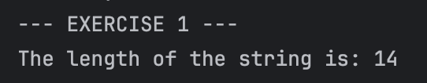
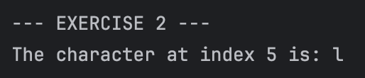
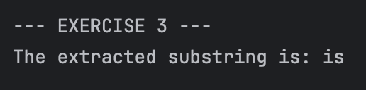
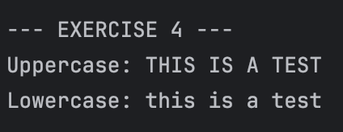
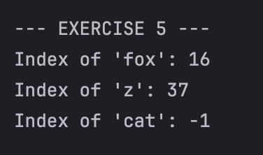
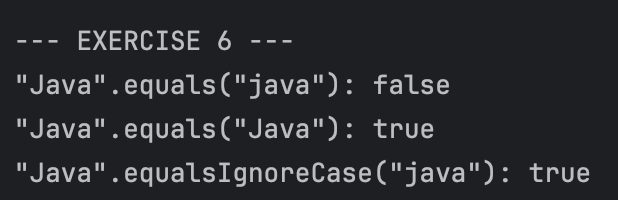
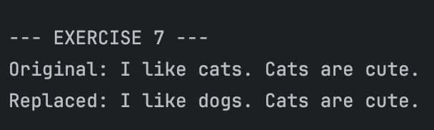
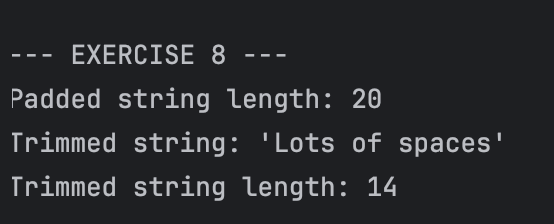

# JC-Exploring-Java-String-Methods
**Name:** Nuan Patricia Serrano  
**Project Title:** Exploring Java `String` Methods 
**Screenshot:**
- Exercise 1: length() - Finding the String's Size  
  
- Exercise 2: charAt() - Accessing a Character  
  
- Exercise 3: substring() - Extracting a Part of a String  
  
- Exercise 4: toUpperCase() and toLowerCase() - Changing Case  
  
- Exercise 5: indexOf() - Finding a Character or Substring  
  
- Exercise 6: equals() vs. equalsIgnoreCase() - Comparing Strings  
  
- Exercise 7: replace() - Replacing Characters  
  
- Exercise 8: trim() - Removing Whitespace  
  

